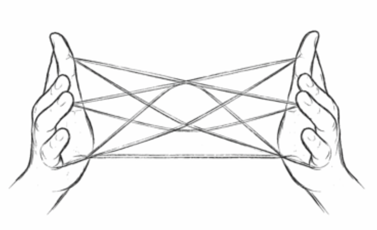

# Ayatori
[](https://github.com/serefayar/ayatori/actions/workflows/test.yml)



> \
> あやとり
>
> The name comes from ayatori, the Japanese string figure game known in English as cat's cradle.

A graph-based AI agent orchestration engine built in Clojure. Nodes are functions, edges define routing, the executor handles the rest.

See the [introductory article](https://serefayar.substack.com/p/ayatori-agent-orchestration-engine-in-clojure).

> [!WARNING]
> **Status:** Proof of concept, under active development. Not production-ready.

## How it works

```
deps -> agent(nodes, edges) -> caps
```

1. **Agent** validates topology and binds node implementations (`make-agent`)
2. **System** groups named agents with shared middleware, wiring, and state store (`make-system`, `start!`/`stop!`)
3. **Run** executes a cap through a system, returns a core.async channel (`run`)

## Quick Start

```clojure
(require '[ayatori.core :as aya]
         '[clojure.core.async :as async])

(def lookup-tool
  {:name "lookup"
   :description "Look up order by ID"
   :schema [:map [:id :int]]})

(def assistant
  (aya/make-agent
    {:nodes {:validate (fn [input _]
                         {:result {:query (:content input)}})
             :llm {:type :llm
                   :client {:provider :ollama
                            :model "gpt-oss:20b"
                            :base-url "http://localhost:11434"}
                   :prompt "You are an order assistant."
                   :tools [lookup-tool]
                   :response-format {:type :json-schema
                                     :schema [:map [:answer :string] [:found :boolean]]}
                   :memory {:strategies [{:type :sliding-window
                                          :max-messages 20
                                          :preserve-system true}]}}
             :lookup (fn [{:keys [id]} _]
                       {:result (str "Order " id ": shipped")})}
     :edges {:validate :llm
             :llm {:done :ayatori/done
                   :lookup :lookup}
             :lookup :llm}
     :caps {:chat {:entry :validate
                   :output [:map [:answer :string] [:found :boolean]]}}}))

(def sys (-> (aya/make-system {:agents {:assistant assistant}})
             aya/start!))

(async/<!! (aya/run sys :assistant :chat {:content "What is the status of order 123?"}))
;; => {:answer "Your order #123 has been shipped." :found true}

(aya/stop! sys)
```

## Documentation

- [Agents](doc/agents.md) - Caps, deps, capability URIs, wiring
- [Nodes](doc/nodes.md) - Node types, function signature, edges, lifecycle
- [System](doc/system.md) - Runtime management, store
- [LLM](doc/llm.md) - LLM node, tools, structured output, streaming
- [Memory](doc/memory.md) - Conversation memory strategies
- [Middleware](doc/middleware.md) - Observability hooks

## TODOs

- [ ] Distributed execution: multi-node transport, capability-aware routing
- [ ] [kex](https://github.com/serefayar/kex) integration: cryptographic capability tokens
- [ ] LLM providers: OpenAI, Anthropic (currently only Ollama)
- [ ] MCP integration: server and client

## License

Copyright (c) 2026 Seref R. Ayar.
Distributed under the Eclipse Public License version 1.0.
