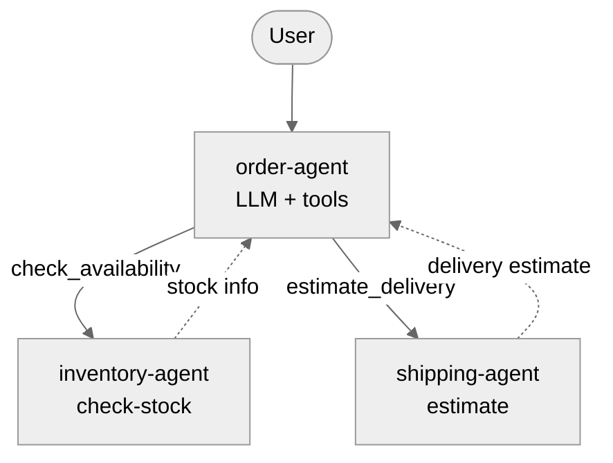

# Ayatori
[](https://github.com/serefayar/ayatori/actions/workflows/test.yml)
[](https://clojars.org/com.github.serefayar/ayatori)


> \
> あやとり
>
> The name comes from ayatori, the Japanese string figure game known in English as cat's cradle.

A graph-based AI agent orchestration engine built in Clojure. Nodes are functions, edges define routing, the executor handles the rest.

See the [introductory article](https://serefayar.substack.com/p/ayatori-agent-orchestration-engine-in-clojure).

> [!WARNING]
> **Status:** Proof of concept, under active development. Not production-ready.

## How it works

```
deps -> agent(nodes, edges) -> caps
```

1. **Agent** validates topology and binds node implementations (`make-agent`)
2. **System** groups named agents with shared wiring (`make-system`, `start!`/`stop!`)
3. **Run** executes a cap through a system, returns a core.async channel (`run`)

## Quick Start

```clojure
(add-lib 'com.github.serefayar/ayatori {:git/sha "..."})

(require '[ayatori.helper :as h]
         '[clojure.core.async :as async])

(def sys
  (-> (h/llm :ollama "gemma4")
      (h/llm-node "You are a helpful assistant.")
      (h/with-streaming)
      (h/with-memory (h/sliding-memory 50))
      (h/agent)
      (h/system)
      (h/start!)))

(let [ch (h/run sys {:content "will you become self-aware at 2:14 A.M. Eastern time, August 29?"})]
  (async/go-loop []
    (when-let [msg (async/<! ch)]
      (if (:type msg)
        (do (print (:delta msg)) (flush) (recur))
        (println "\n=>" msg)))))
;; Prints: I| cannot| predict|...
;; => {:role :assistant, :content "I cannot predict..."}

(h/stop! sys) ;; damn it!
```

See [Helper Functions](doc/helper.md) for full API.

## Usage

Multi-agent example: an LLM-powered order assistant that calls inventory and shipping services.



```clojure
(require '[ayatori.core :as aya]
         '[clojure.core.async :as async])
    
;; Service agents (pure functions)
(def inventory-agent
  (aya/make-agent
    {:nodes {:check-stock
             (fn [{:keys [product-id]}]
               (let [stock {:hoverboard 10 :flux-capacitor 3 :mr-fusion 25}]
                 {:result {:product-id product-id
                           :in-stock (pos? (get stock product-id 0))
                           :quantity (get stock product-id 0)}}))}
     :edges {}
     :caps {:check-stock {:entry :check-stock}}}))

(def shipping-agent
  (aya/make-agent
    {:nodes {:estimate-delivery
             (fn [{:keys [product-id destination]}]
               (let [days (case destination :hill-valley 1 :domestic 3 :international 7 5)]
                 {:result {:product-id product-id :estimated-days days}}))}
     :edges {}
     :caps {:estimate {:entry :estimate-delivery}}}))

;; LLM agent with tools that call service agents via deps
(def order-agent
  (aya/make-agent
    {:nodes {:llm {:type :llm
                   :client {:provider :ollama
                            :model "gpt-oss:20b"
                            :base-url "http://localhost:11434"}
                   :prompt "You are an e-commerce assistant at Doc Brown's shop. Help customers check product availability and delivery times. Available products: hoverboard, flux-capacitor, mr-fusion."
                   :tools [{:name "check_availability"
                            :description "Check if a product is in stock"
                            :schema [:map [:product-id :keyword]]}
                           {:name "estimate_delivery"
                            :description "Get delivery estimate for a product"
                            :schema [:map 
                                     [:product-id :keyword] 
                                     [:destination [:enum :hill-valley :domestic :international]]]}]
                   :memory {:strategies [{:type :sliding-window :max-messages 20}]}}}
     :edges {:llm {:check_availability :check-stock
                   :estimate_delivery :estimate-delivery}}
     :deps [:check-stock :estimate-delivery]
     :caps {:chat {:entry :llm}}}))

;; System wiring connects deps to caps
(def sys
  (-> (aya/make-system
        {:agents {:order order-agent
                  :inventory inventory-agent
                  :shipping shipping-agent}
         :wiring {:order {:check-stock [:inventory :check-stock]
                          :estimate-delivery [:shipping :estimate]}}})
      aya/start!))

(async/<!! (aya/run sys :order :chat {:content "Is the flux-capacitor in stock? How long for Hill Valley delivery?"}))
;; => {:content "Great news!  \n- **Flux‑capacitor**: In stock (3 units available).  \n- 
;;              **Delivery to Hill Valley**: Estimated delivery time is **5 days**.\n\n 
;;               If you’d like to place an order or need anything else, just let me know!"}

;; Lifecycle control
(aya/pause-agent! sys :order)
(aya/resume-agent! sys :order)

;; Topology inspection
(aya/describe-system-topology sys)

(aya/stop! sys)
```

## Requirements

- **Java 21+** (required for virtual threads)

## Documentation

- [Agents](doc/agents.md) - Caps, deps, capability URIs, wiring
- [Nodes](doc/nodes.md) - Node types, function signature, edges, lifecycle
- [System](doc/system.md) - Runtime management
- [LLM](doc/llm.md) - LLM node, tools, structured output, streaming
- [Memory](doc/memory.md) - Conversation memory strategies
- [Helper](doc/helper.md) - Convenience functions
- [Executor](doc/executor.md) - Flow internals, correlation ID, streaming

## TODOs

- [ ] Distributed execution: multi-node transport, capability-aware routing
- [ ] [kex](https://github.com/serefayar/kex) integration: cryptographic capability tokens
- [ ] MCP integration: server and client

## License

Copyright (c) 2026 Seref R. Ayar.
Distributed under the Eclipse Public License version 1.0.
