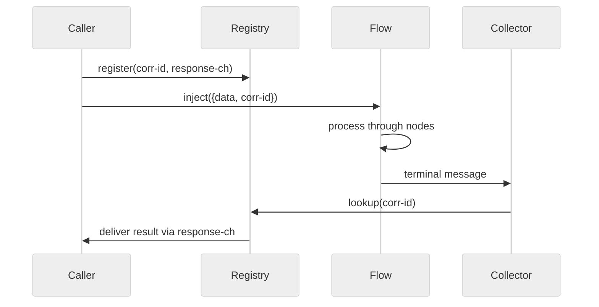
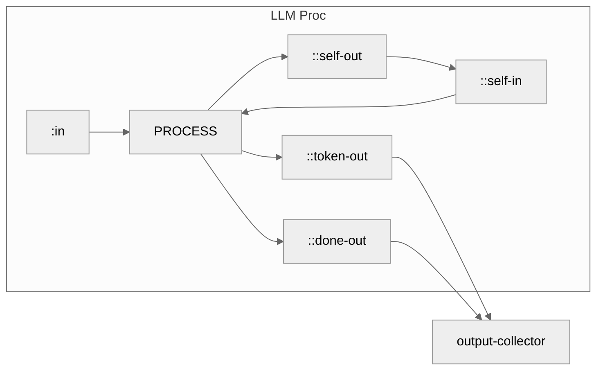
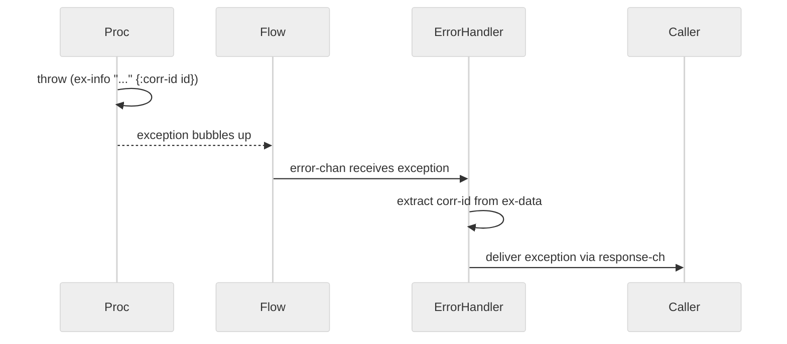

# Executor

Ayatori uses `core.async.flow` for graph execution. The public API remains unchanged.

## How It Works

When you call `start!`, each agent's graph compiles to a flow topology:

```
make-agent -> start! -> flow topology -> run
```

Nodes become flow processes, edges become connections. You don't interact with flow directly.

Flow provides lifecycle control (`pause-agent!`, `resume-agent!`, `ping-agent`), automatic backpressure, error isolation.

## Correlation ID

Ayatori needs request/reply semantics: send input, get result back. Flow has no built-in mechanism for this.

Each request gets a unique correlation ID (`corr-id`). A registry maps corr-ids to response channels.



**Key components:**

- **corr-id**: UUID attached to every message, preserved through all nodes
- **result-registry**: `atom` mapping `{corr-id -> {:ch response-chan}}`
- **output-collector**: special proc that receives terminal messages and delivers to callers

```clojure
;; On inject
(let [corr-id (str (random-uuid))
      result-ch (async/promise-chan)]
  (swap! result-registry assoc corr-id {:ch result-ch})
  (flow/inject flow [entry-key :in] [{:data input :corr-id corr-id}])
  result-ch)

;; On output-collector
(deliver-result! registry (:corr-id msg) (:data msg))
```

### Message Format

All messages flowing through the graph carry:

```clojure
{:data       <actual payload>
 :corr-id    "uuid-string"
 :fan-out-id <uuid>}  ;; only for fan-out branches
```

Nodes extract `:data`, process it, and emit with same `:corr-id`.

### Fan-Out

Fan-out nodes broadcast to multiple branches in parallel. Each branch receives the same `corr-id` plus a `fan-out-id` to track which parallel execution it belongs to. When all branches complete, results are collected and emitted with the original `corr-id`.

Flow does not yet provide a built-in way to wait for results from multiple branches. Rich Hickey has noted a planned `sync->map` process that will handle exactly this. For now, step state serves as a workaround: the fan-out process accumulates branch results across invocations and emits only when all have arrived.

## LLM Streaming

LLM nodes support streaming responses (SSE from providers). This requires processing events as they arrive while maintaining correlation.

### Self-Loop Pattern

Instead of injecting events back into the flow externally, LLM proc uses self-loop ports:



### How It Works

**Step 1: Request arrives at `:in`**

```clojure
;; Input: {:data "user prompt" :corr-id "abc-123"}
(let [stream-ch (llm/start-stream config data state)]
  [(assoc state :stream-ch stream-ch :corr-id corr-id :accumulated "")
   {::self-out [{:type :next}]}])
```

- Initiates HTTP request to LLM provider
- Gets back an SSE stream channel
- Stores channel in proc state
- Emits to `::self-out` to trigger the read loop

**Step 2: Self-loop triggers (`::self-in`)**

Flow routes `::self-out` → `::self-in` (same proc). The proc is invoked again:

```clojure
(let [event (async/<!! (:stream-ch state))]
  ;; Handle based on event type
  )
```

Blocking read from stream channel. Safe because flow uses virtual threads (`:workload :io`).

**Step 3a: Delta event (token)**

```clojure
;; Event: {:type :delta :delta "Hello"}
[(update state :accumulated str "Hello")
 {::token-out [{:delta "Hello" :corr-id corr-id}]
  ::self-out [{:type :next}]}]
```

- Emit token to `::token-out` → caller's channel
- Emit to `::self-out` → loop back to step 2

**Step 3b: Done event**

```clojure
;; Event: {:type :done :message {:role :assistant :content "..."}}
[(dissoc state :stream-ch :corr-id :accumulated)
 {::done-out [{:data final-msg :corr-id corr-id}]}]
```

- Clear streaming state
- Emit final message
- Loop ends (no `::self-out`)

### Why Self-Loop?

Alternative approach uses `flow/inject` to push events from outside:

```clojure
;; Requires circular reference
(let [flow-ref (atom nil)]
  (reset! flow-ref flow)
  (flow/inject @flow-ref [:llm :event] sse-event))
```

Problems:
- Proc needs reference to flow (circular dependency)
- Proc knows about flow topology (tight coupling)
- Harder to test

Self-loop keeps proc pure: input ports in, output ports out. Flow topology handles routing.

## Error Handling

Errors must preserve `corr-id` to deliver exceptions back to the correct caller. Flow's `error-chan` provides centralized error handling.



### How It Works

Procs throw exceptions with `corr-id` in ex-data:

```clojure
(catch Throwable e
  (throw (ex-info "Node execution failed"
                  {:corr-id corr-id :node node-key} e)))
```

Error handler extracts corr-id and delivers to caller:

```clojure
(let [ex (::flow/ex err)
      corr-id (some-> ex ex-data :corr-id)]
  (when corr-id
    (deliver-result! result-registry corr-id ex)))
```

### Why This Matters

Without `corr-id` in exceptions, errors would go to `error-chan` but we couldn't match them to callers. Each caller would timeout instead of receiving the actual error.

This approach:
- Preserves request/reply semantics for errors
- Follows flow's centralized error handling pattern
